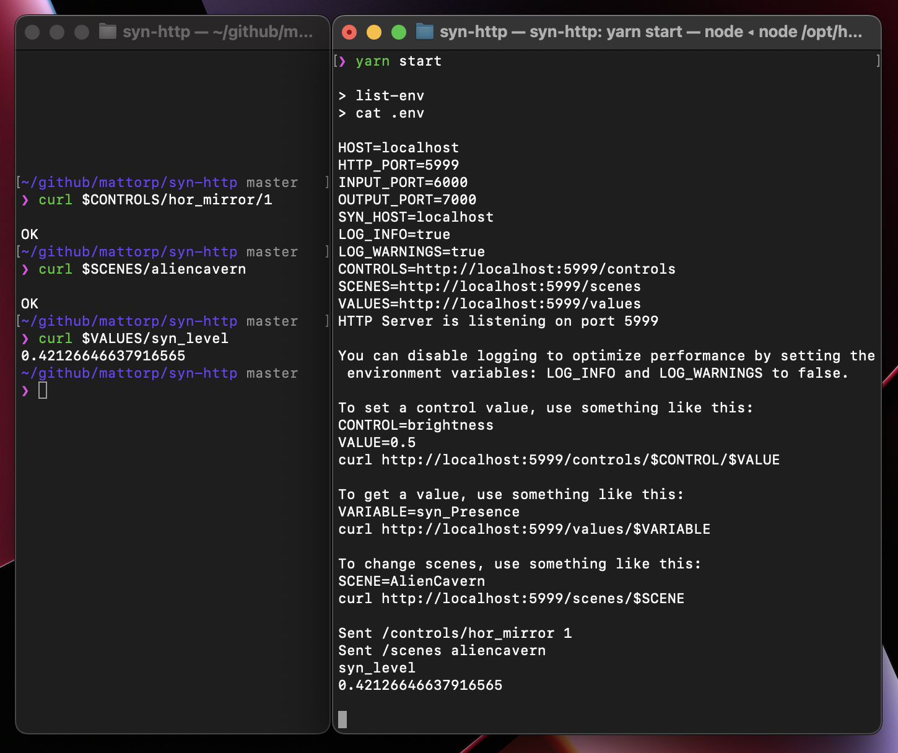

# syn-http

This is an HTTP endpoint for [Synesthesia](https://synesthesia.live). For now, it supports setting controls and scenes and getting values from Synesthesia including audio variables. The purpose is to provide a URL interface, that map to OSC messages.

NOTE: Synesthesia Pro is required for this to work.



- [Installation](#installation)
- [Usage](#usage)
- [Examples](#examples)
  - [Set Controls](#set-controls)
  - [Set Scene](#set-scene)
  - [Get Values](#get-values)
- [Available Values](#available-values)
- [Available Controls](#available-controls)
- [Convenience](#convenience)

It will include a CLI tool later to avoid having to clone this repo. Note that this should not be used to build upon for now. It's in a very early stage of development. I just needed the functionality for now, but a cleaner solution will be implemented later.

Note that this is not affiliated with the team behind Synesthesia. For problems or suggestions please open an issue here.

For the official Synesthesia OSC interface, you can find documentation [here](https://synesthesia.live/docs/manual/osc.html)

## Installation

Node.js must be installed to use this.

```bash
git clone https://github.com/mattorp/syn-http
cd syn-http
```

Run the following command in the root directory of the repository:

If using npm:
  
```bash
npm install
```

If using yarn:
  
```bash
yarn install
```

## Usage

Turn on OSC input and output in Synesthesia settings.


Then start the server:

```bash
npm run start
```

Then send an HTTP request to the server (see [Examples](#examples) below) e.g. using bash from another terminal. The default port for the server is 5999. It can be changed in ./.env

>The control name is insensitive to case and spacing characters like "_" and "-", so you don't have to be exact; "/controls/my_slider", "/controls/MySlider", and "/controls/m-Y-s-L-i-D-e-R" would all update the same slider. [^control-names]

[^control-names]: https://synesthesia.live/docs/manual/osc.html

All controls are normalized to the range 0-1. E.g., brightness is shown as -1 to 0 in the app, but use 0 to set it to 0%, and 1 to set it to 100%.

[Examples folder](./examples)

## Examples

### Set Controls

```bash
CONTROL=brightness
VALUE=0.5
curl http://localhost:5999/controls/$CONTROL/$VALUE
```

The values d and r can be used to send the default value (as defined in scene.json) or a random value.

```bash
CONTROL=brightness
VALUE=d
curl http://localhost:5999/controls/$CONTROL/$VALUE
```

```bash
CONTROL=brightness
VALUE=r
curl http://localhost:5999/controls/$CONTROL/$VALUE
```

### Set Scene

```bash
SCENE=AlienCavern
curl http://localhost:5999/scenes/$SCENE
```

The scene names can be found in the Synesthesia app.

### Get Values

```bash
VARIABLE=syn_Presence
curl http://localhost:5999/values/$VARIABLE
```

## Available Values

[Examples](examples/values.md)

These values are available from Synesthesia:

```txt
syn_ToggleOnBeat
syn_Threshold
syn_MidPresence
syn_RandomOnBeat
syn_MidHits
syn_MidHighTime
syn_MidHighLevel
syn_MidHighHits
syn_Level
syn_Hits
syn_PrimeBang
syn_MidLevel
syn_Intensity
syn_OnBeat
syn_HighTime
syn_HighPresence
syn_BPMTwitcher
syn_HighLevel
syn_HighHits
syn_CurvedTime
syn_MidHighPresence
syn_BPMSin4
syn_BassHits
syn_BassExpoCurve
syn_BassPresence
syn_RawLevel
syn_BPMTri2
syn_Time
syn_BPMConfidence
syn_BPMTri
syn_FadeInOut
syn_BassLevel
syn_BassTime
syn_BPMSin2
syn_Presence
syn_MidTime
TIME
syn_BPM
syn_BPMSin
syn_BeatTime
```

## Available Controls

[Examples](examples/setControls.md)

Meta controls:

```txt
invert
brightness
gamma
contrast
hue
saturation
vert_mirror
hor_mirror
invert_media
fit_or_fill
media_contrast
paused
playback_speed
reactivity
audio_speed
limit_colors
low_color
high_color
transition
```

Scene controls:

```txt
scene-toggle-<i>
scene-slider-<i>
scene-bang-<i>
scene-knob-<i>
scene-xy-<i>
scene-color-<i>
scene-dropdown-<i>
```

<i> is the 0-based index of the type of control, in order of appearance in the scene.json file.

You can also use the name of the control:

```bash
SCENE=AlienCavern
CONTROL=droppers
curl http://localhost:5999/scenes/$SCENE
curl http://localhost:5999/controls/$CONTROL/1
```

## Convenience

You can source the .env file to export the variables to your shell. Navigate to the root directory of the repository and run:

```bash
source .env
```

This includes the shorthand variables:

```bash
CONTROLS=http://localhost:5999/controls
SCENES=http://localhost:5999/scenes
VALUES=http://localhost:5999/values
```

Which can be used like this:

```bash
curl $CONTROLS/brightness/0.5
curl $SCENES/AlienCavern
curl $VALUES/syn_Presence
```
